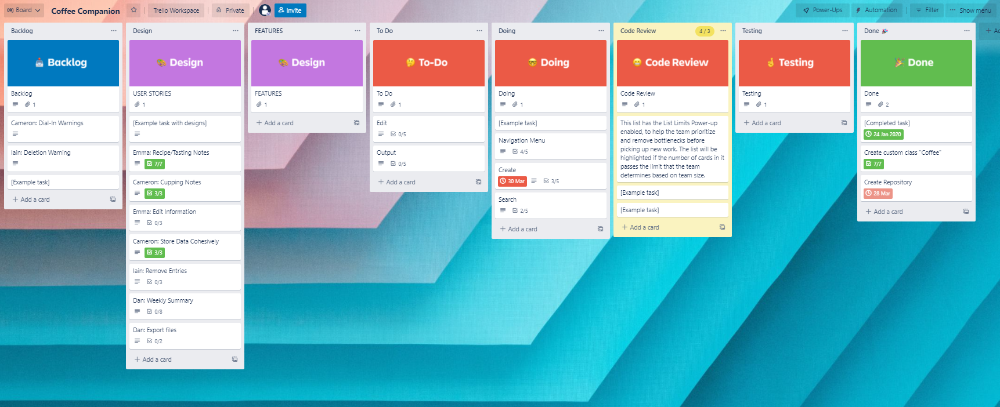

*No.	Requirement
R1	Answers to all the documentation requirements below.
R2	Your README.md should have a separate heading for each documentation requirement and answers organised under the appropriate headings.

*R8	
Design help documentation which includes a set of instructions which accurately describe how to use and install the application.

You must include:
- steps to install the application
- any dependencies required by the application to operate
- any system/hardware requirements
- how to use any command line arguments made for the application*

r15
Design TWO tests which check that the application is running as expected.

Each test should:
- cover a different feature of the application
- state what is being tested
- provide at least TWO test cases and the expected results for each test case

> An outline of the testing procedure and cases should be included with the source code of the application*

-------------------------------------------------------------------------------

# Coffee-Companion
This repository houses the source code for the Coffee Companion app.
This app is being developed as a Terminal Application assessment.
The function of the app is to record and output information about the performance of a coffee over time; aimed primarily at a head barista or manager.

----------------------------------------------------------------------------

## References
Coffeekaizen.com. n.d. COFFEE KAIZEN. [online] Available at: <http://coffeekaizen.com/calculators/extcalculator/> [Accessed 1 April 2022].

Rubystyle.guide. 2022. The Ruby Style Guide. [online] Available at: <https://rubystyle.guide/> [Accessed 5 April 2022].

-----------------------------------------------------------------------

## Source Control
This source code for this project is hosted at [GitHub](https://github.com/Champ-Dog/Coffee-Companion).

Should the above link not function, you can manually enter this address:
https://github.com/Champ-Dog/Coffee-Companion

-----------------------------------------------------------------------

## Code Style
Code for this project is written in Ruby, and should adhere to [The Ruby Style Guide](https://rubystyle.guide/) to the extent possible. 

In developing this project I have made use of [RuboCop](https://rubocop.org/) to simplify adherence, as well as referring directly to the material. It has been necessary to violate these conventions in several places for proper code or gem functions.

-------------------------------------------------------------------------

## Features
The Coffee Companion is a quality assurance tool for baristas and cafe owners/managers. It allows information about coffees to be stored, searched, edited, summarised, and exported.

### Save
The Coffee Companion is primarily a tool to store information about coffees. Users 'create' a new entry with the origin and name of a particular bean. Additional information can then be attached to that entry to store recipes and cupping notes. This information is stored between sessions in a seperate file.

**Technical:** A custom Coffee class has been created to contain information about particular coffees. Each coffee stored in the app is a new Coffee class instance. This class has attributes to store `@origin`, `@name`, and cupping notes (as `@highlight`, `@minimise`, and `@tactile`). 

A Recipes module is included with the Coffee to add a recipes attribute, where seperate recipes can be stored as arrays. This has been seperated from the Coffee class for both conceptual and functional reasons. Conceptually, a brewing recipe is not an inherent attribute of a given coffee, unlike it's origin, name, flavour, and mouthfeel. Functionally, recipes need to be handled differently to other attributes. 

The values of the other attributes of a Coffee object are still useful to the user in a variety of formats: a collection of flavour descriptors stored in a one- or multi-dimensional array, or becoming disordered, is unlikely to impact meaning when displayed as text to the user. However, an object is expected to store multiple recipes, which quickly become meaningless when not kept distinct. As such, `@recipes` needs to be maintained as a two-dimensional array, with each stored array containing a separate recipe. The ordering of a given recipe also needs to be preserved, both to comply with coffee industry convention of describing recipes as Dose, Yield, Time, TDS, EXT; and to successfully summarise the range of values across each stored recipe. This convention initially suggests Hashes as an appropriate structure, however this does not allow for multiple recipes to work as intended: having all TDS values assigned against a single key would only be helpful for the Summary feature, and would severely curtail usefulness in recording and checking individual recipes. Moving forward from this assessment, it is likely the Recipes module will be developed into it's own Class to allow for more complex modelling and behaviours, and further modularising between espresso- and filter-based recipes.

The Coffee class includes a class attribute `@@coffees`, an Array that self-populates when a Coffee class object is instantiated. A class method is included to return the values stored in this Array, allowing for all extant Coffee objects to be easily exported in .json format. This allows for coffees to be saved between sessions, by exporting when the program is closed; and on startup parsing the saved file and instantiating new Coffee objects based on the returned data.

### Search
The Coffee Companion allows users to search against stored coffees by either name (for a specific coffee) or origin (to show all coffees from a region).

**Technical:** As the Coffee class contains a self-populating record of all class instances (`@@coffees`), it is possible to search through extant Coffee objects. Two custom methods are included in the class, calling `.select` against `@@coffees` to return matches based on `@origin`, or `@name`, respectively. Users are prompted to input a search type (search by `@origin` or `@name`), then a search term; then to select from the return matches.

Currently, search functionality is limited to exact matches (e.g., a two-part name such as 'La Serrania' will only return as a match for if the whole name is entered, and not for 'Serrania'). This limitation is earmarked for improvement in future development.

### Edit
User can edit or remove stored information about a coffee, or remove a coffee entirely if it is no longer relevant.

**Technical:** Editing is implemented through including attribute readers in the Coffee class. This allows values to be assigned dynamically. Once a coffee is selected through the search feature, users select an attribute to change, and provide a new value to overwrite the previous.

Current implementation allows for the changing of `@origin` and `@name` together, cupping notes (`@highlight`, `@minimise`, and `@tactile`) together, or recipes (individually). When editing cupping notes, a `.nil?` check is implemented to allow changes to be made to desired attributes only. User input is gathered for each, using the same code implemented to create a new Coffee object. This input is then checked for values, and only the attributes for which values were returned are overwritten. Recipes can be edited invdividually by providing new input for each parameter, or deleting a selected recipe.

Again, the reasons for the difference in behaviours are both conceptual and functional. The name and origin of a bean are standard values used together to identify or refer to a particular coffee in real-world contexts. They have therefore been treated as eseential information, and the code enforces values for these attributes (using the `.required` method of `tty-prompt`). This also reduces the possibilites for error in the app, as these are the attributes against which the user searches. Flavour descriptors are likely to be generated, and are most helpful, together, so `@highlight`, `@minimise`, `@tactile` are created and edited together; although it is possible to leave one, or all, of these Arrays empty, or unchanged (as described). The difference in behaviour for recipes has been explored above; additionally the ability to remove an individual recipe without impacting the integrity of others is a significant increase in value to the user. This is implemented through a custom method in the Recipes module, which calls `.delete` on the selected recipe.

As much as possible, the same process is used to collect user input and create a new Coffee instance as to change an existing one, to minimise the amount of code required. Custom modules (Create and Manipulate) house the flow control, custom methods, and helper methods, used in this feature, and the creation of new Coffee objects. These are implemented as `self` methods, as there is currently no reason for instantiation from these modules.

### Summarise
The Coffee Companion will summarise key information about a coffee, for quick reference or reporting. Summaries will show the recipe range for a coffee, along with stored flavour descriptors, in an easy to read format.

**Technical:** A Summaries module is included by the Coffee class, extending the capabilities of the class with a selection of new methods. These methods return stored information to be displayed or exported in an easily-read format.

For `@highlight`, `@minimise`, and `@tactile`, both `.flatten` and `.join` are called, before returning values. This allows both display and export to appear coherently on one line with the `puts` method.

The Recipes module contains specialised methods to produce a recipe summary. The `each` enumerator is used on `@recipes` to return and `sort` each value at index [0] amongst stored recipe Arrays, and so on for each index position. These values are passed to a new method, which returns the highest and lowest values (index [0] and [-1] after sorting) to produce a min-max range for each recipe parameter. This range is more valuable to communicating the performance of a particular coffee than acollection of individual recipes.

### Export
The Coffee Companion includes an export feature, allowing summaries of selected coffees to be saved in .txt format. This allows for simple reporting between staff, stores, roasters, or other stakeholders.

**Technical:** This feature is implemented through Ruby's inbuilt `File` feature. A *report.txt* file is included with the app. Instructions are passed to open the file to append new data, new data is added, and the app is closed. This method is included in the Manipulate module, and is a selectable option once a Search has been successfully completed.

-------------------------------------------------------------------------------

## Implementation

A [Trello Kanban board](https://trello.com/b/356sGY0f/coffee-companion) was developed at the outset of this project, beginning with user stories. These user stories were based on actual coffee professionals, all stakeholders in the QA process on which this project is based. Their stories reflect their roles within the process and/or run of a coffee within a cafe.

Once user stories were developed, the details or steps required to fulfil them were specified; these were used as requirements for different app features. The features themselves were then used to populate a To-Do list, along with other tasks.

In retrospect, the implementation process could have been improved in several areas. As this was my first experience with this process + tools, some features were overlooked or applied inconsistently. Without experience with this kind of project, or implementation management, setting of priorities was far from optimised. Some of the more visible + deliverable elements of the project were implemented after less tangible 'under the hood' development. This led to a more disrupted, less cohesive development process than necessary; and also created extra work in refactoring code for public release.

Other difficulties were in estimating the time needed for given tasks, underestimating the scope of both the app and and individual features, and intelligently managing smaller tasks on the board that don't fit neatly into a particular feature.

The board also contains a list of additional features that will add value to the app, but are beyond the scope of this assessment. If the in-line link to the Trello board above should fail to function, the board can be found at:
https://trello.com/b/356sGY0f/coffee-companion

----------------------------------------------------------------------------------

## Dependencies
This is a terminal application, and is written in Ruby. It is therefore necessary to have a terminal environment (e.g., bash, WSL), and to include Ruby + appropriate management in this environment. 

More information about implementing a Ruby environment can be found [here.](https://www.ruby-lang.org/en/documentation/installation/)

A Windows-specific solution can be found [here.](https://rubyinstaller.org/about/)

Gems (Bundled)
-  oj
-  pastel
-  rspec (for testing)
-  tty-file
-  tty-prompt